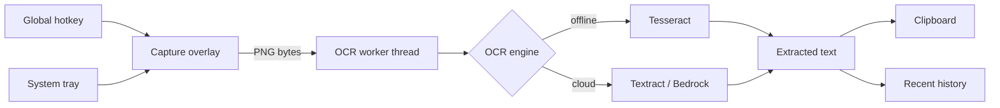

# Phil Dev Desktop OCR

A Phil Dev project.

A Windows desktop app that captures a region of your screen and extracts its
text with OCR. It runs from the system tray and is triggered by a global
hotkey. OCR runs offline with Tesseract by default, and can use Amazon Textract
or Amazon Bedrock for higher-quality results when you have internet access.

This is the desktop evolution of the serverless
[screen-snip-ocr](https://github.com/arielsubia/screen-snip-ocr) project. The
cloud OCR path reuses that project's Amazon Textract integration.

## Features

- Global hotkey (default `Ctrl+Shift+X`) to start a capture
- Transparent overlay to select any area across all monitors
- Offline OCR with Tesseract (no internet required)
- Optional cloud OCR with Amazon Textract or Amazon Bedrock
- Extracted text is copied to the clipboard automatically
- Recent-capture history
- Minimal UI that lives in the system tray

## Architecture



## Requirements

- Windows 10/11
- Python 3.12
- [Tesseract OCR](https://github.com/tesseract-ocr/tesseract) for offline mode
- AWS credentials (only for cloud OCR)

### Installing Tesseract

Tesseract is a separate native binary. Install it with winget:

```powershell
winget install --id UB-Mannheim.TesseractOCR
```

The app auto-detects `tesseract.exe` on `PATH` and in the standard
`C:\Program Files\Tesseract-OCR` location. If you installed it elsewhere, set
the path in **Settings → Tesseract path**.

## Local Development Setup

```powershell
# 1. Clone
git clone https://github.com/arielsubia/desktop-ocr-phil.git
cd desktop-ocr-phil

# 2. Create and activate a virtual environment
python -m venv .venv
.\.venv\Scripts\Activate.ps1

# 3. Install development dependencies (includes runtime deps)
pip install -r requirements-dev.txt

# 4. Run the app from source
python -m phildev_ocr
```

> The `src/` layout means the package is importable via `PYTHONPATH=src`,
> which `pyproject.toml` already configures for pytest.

### Running checks

```powershell
# Lint (run before every commit)
ruff check .

# Tests (headless Qt + dummy AWS credentials)
$env:QT_QPA_PLATFORM = "offscreen"
pytest
```

### Building the executable

```powershell
.\packaging\build.ps1
# Output: dist\PhilDevDesktopOCR.exe
```

The build embeds Windows version metadata with **Phil Dev** as the publisher.

## Usage

1. Launch the app. It appears in the system tray.
2. Press the global hotkey (`Ctrl+Shift+X`) or use the tray menu to capture.
3. Drag to select a screen region. Press `Esc` to cancel.
4. The extracted text is copied to your clipboard and added to history.

Switch between offline and cloud OCR in **Settings**.

## Cloud OCR (AWS)

Cloud OCR needs AWS credentials resolvable by boto3 (for example via
`aws configure` or environment variables) and the relevant permissions:

- **Textract**: `textract:DetectDocumentText`
- **Bedrock**: `bedrock:InvokeModel` for the configured model

Credentials are never stored by the app; they are read from your standard AWS
configuration.

## Configuration

Settings and history are stored per-user under
`%LOCALAPPDATA%\PhilDevDesktopOCR\`.

## License

Proprietary — Phil Dev <sub></sub>
